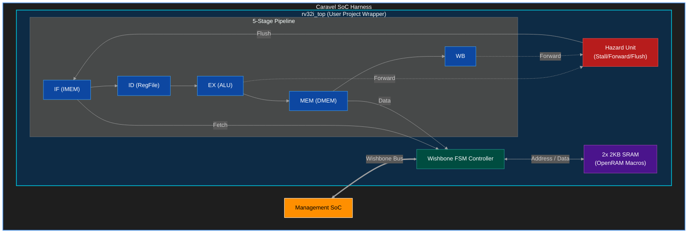
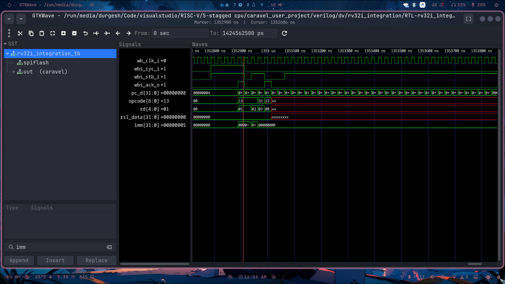

# 5-Stage RV32I CPU for Caravel

Welcome to the central repository for the custom 5-Stage RV32I Processor. This repository contains the RTL, physical layout, and comprehensive documentation for integrating a pipelined RISC-V soft core into the Efabless Caravel SoC using the Sky130 PDK.



## Physical Layout (GDSII)

**Isolated Core Layout (`rv32i_top.gds`):**


*The isolated 5-stage RISC-V core showing the two 2KB SRAM macros tightly packed within the synthesized standard cells.*

**Caravel User Project Wrapper (`user_project_wrapper.gds`):**


*The integrated wrapper showing the core nested inside the fixed `2.92mm x 3.52mm` user area. The unused space is properly density-filled with decoupling capacitors to meet tapeout rules.*

---

## RTL Simulation Execution


*GTKWave trace showing the RV32I pipeline actively fetching, decoding, and executing instructions, interacting flawlessly with the Wishbone Memory bus.*

---
## Quick Start
To immediately run the functional RTL simulation and verify that the core executes instructions over the Wishbone bus:
```bash
cd caravel_user_project
make verify-rv32i_integration-rtl PDK_ROOT=/path/to/pdks
```

## Documentation Directory

The project is thoroughly documented. Please refer to the `docs/` folder for all engineering manuals:

- 📖 **[Hardware Specification (spec.md)](./docs/spec.md)** - ISA, frequencies, power, and memory maps.
- 🚀 **[Project Report (project_report.md)](./docs/project_report.md)** - Deep architectural explanations and tapeout summary.
- 🔌 **[Interface Definition (interface.md)](./docs/interface.md)** - Wishbone timing diagrams and pinouts.
- 🛠️ **[Commands Reference (commands_reference.md)](./docs/commands_reference.md)** - OpenLane and Precheck docker commands.
- 🧪 **[Simulation Setup (verification.md)](./docs/verification.md)** - Testbench architectures and coverage metrics.
- 🐛 **[Errors & Resolutions (errors_and_resolutions.md)](./docs/errors_and_resolutions.md)** - The full problem log and how routing DRCs were solved.
- 📜 **[Coding Rules (coding_rules.md)](./docs/coding_rules.md)** - SystemVerilog conventions for synthesis.
- 📅 **[Timeline (timeline.md)](./docs/timeline.md)** - Tapeout milestones.
- 📖 **[Glossary (glossary.md)](./docs/glossary.md)** - VLSI terminology definitions.
